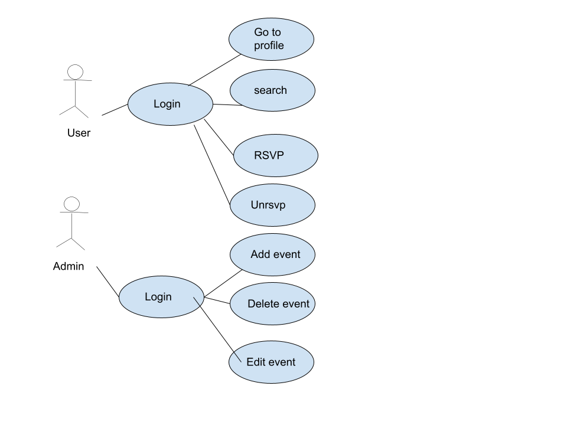

# Eventify - Local Event Finder & RSVP App

## Team Information
- **Team Number:** 14-6
- **Team Name:** Team Eventify
- **Application Name:** Eventify

### Team Members
- Abhiram Kasu
- Joshua Shih
- Robbie Boccard
- Alex Schwab

## Project Overview

### Description
The Local Event Finder & RSVP App is a user-friendly platform that helps people discover and engage with local events such as concerts, meetups, and community gatherings. Users can create an account to browse upcoming events, RSVP or un-RSVP with ease, and view a personalized profile page displaying their attendance history. 

Events are sourced dynamically through the Ticketmaster API or mock data, providing flexibility for both real and test environments. An optional admin feature allows event organizers to create, edit, or delete events to keep listings accurate and up to date. 

This project effectively showcases user interaction, data management, and external API integration, making it an ideal demonstration of full-stack development skills and real-world application design.

### Target Audience
Bored people looking for local events and activities

### Vision Statement
To empower every community member to easily discover, connect, and participate in meaningful local events, fostering vibrant social experiences and lasting connections through effortless digital engagement.

## Development Information

### Methodology
Agile

### Communication Plan
Slack

### Meeting Schedule
Wednesdays at 5:20 PM with TA

## Design Documentation

### Use Case Diagram

### Wireframe Assignments
- **Feed:** Abhiram
- **Add Event Modal:** Abhiram
- **Profile:** Josh
- **RSVP:** Alex
- **Log In:** Robbie
- **Register:** Robbie

## Risk Assessment

### 5 Identified Risks

1. **Data Privacy and Security Breaches**
   - Storing personal information, event details, and potentially payment data can expose users to risks if the app is not properly secured, potentially resulting in unauthorized access or leaks of sensitive information.

2. **Low User Adoption**
   - If the app does not provide a compelling experience or is difficult to use, users may be hesitant to register or interact, resulting in low engagement and reduced event attendance.

3. **Platform Compatibility Issues**
   - If the app does not look good on mobile or across major platforms (iOS, Android, web), it may alienate potential users and limit reach.

4. **Event Data Inaccuracy**
   - Relying on external sources like the Ticketmaster API may result in outdated, incomplete, or incorrect event information being displayed, negatively impacting user trust and experience.

5. **Security Threats from Third-Party Integrations**
   - Integrations with external APIs or services may introduce vulnerabilities if not rigorously vetted, creating risk of unauthorized data sharing, malware, or breaches through insecure connections.